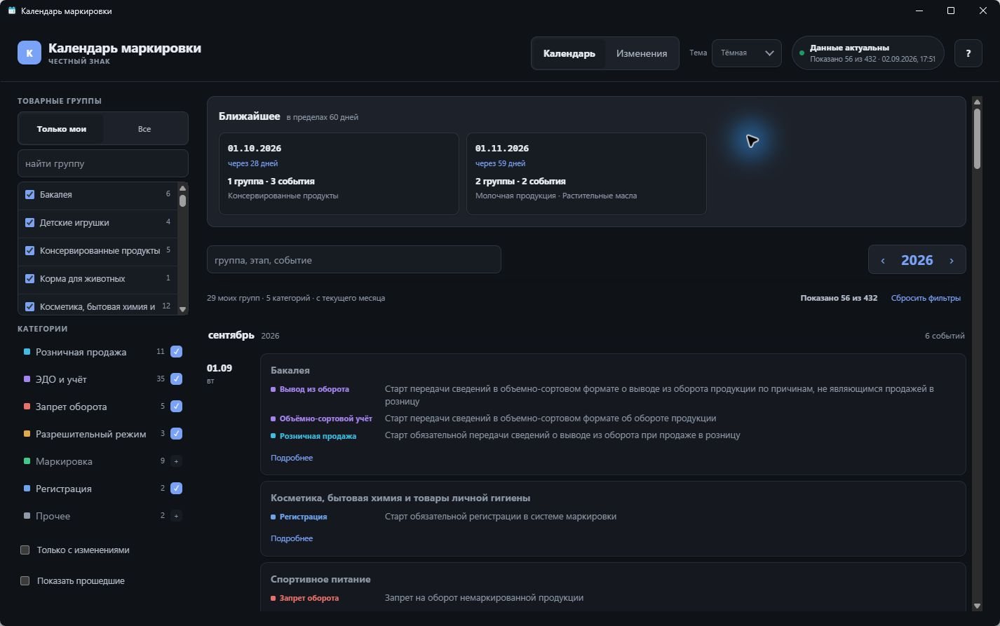
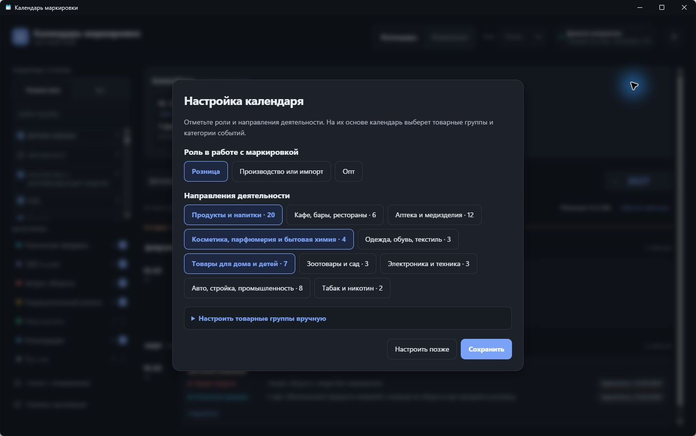
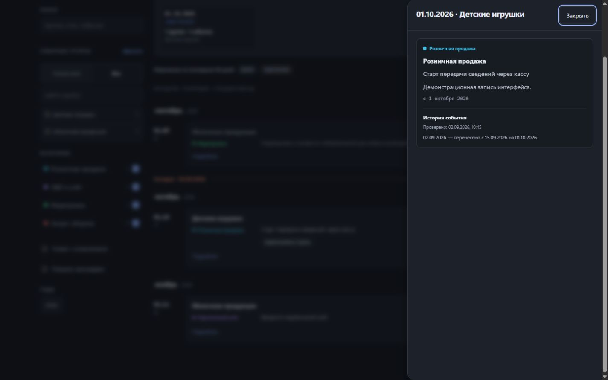
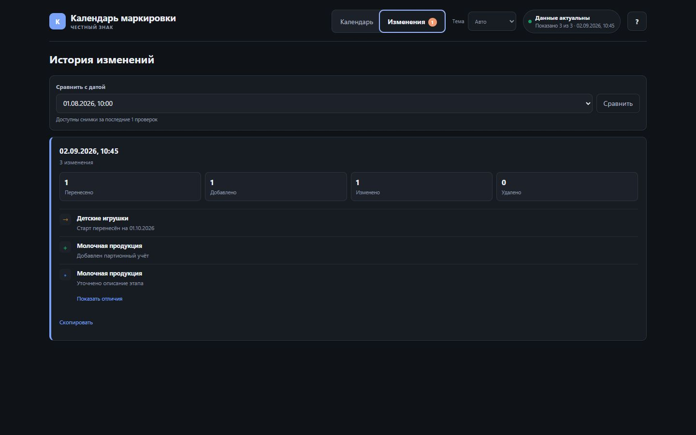

# Календарь маркировки

Windows-приложение с календарём этапов обязательной маркировки товаров: цветовые категории, фильтры, безопасное фоновое обновление данных и история изменений.



## Возможности

- единая календарная лента по месяцам без горизонтальной прокрутки и обрыва на границе года;
- блок ближайших дат с переходом к событию и постепенным расширением периода поиска;
- основной фильтр по товарным группам, полнотекстовый поиск и фильтр категорий с цветом и текстовой подписью;
- одна карточка на дату и товарную группу, внутри которой собраны все этапы;
- правая панель с полным описанием событий и ссылками на официальные источники;
- автоматическая, светлая и тёмная темы;
- быстрый запуск с последним корректным локальным снимком;
- проверка новых данных в фоне без замены рабочего календаря пустым или повреждённым ответом;
- понятное окно со списком изменений, если даты или содержание событий обновились;
- автоматическое обновление установленного приложения через GitHub Releases;
- импорт данных прежней версии без удаления каталога `%LOCALAPPDATA%\CHZ-MarkingCalendar`;
- отсутствие телеметрии, рекламы и обязательной регистрации.

## Товарные группы и профиль

При первом запуске можно необязательно выбрать одну или несколько ролей и отраслей. Приложение сразу отметит подходящие товарные группы; список можно уточнить вручную, а затем в любой момент изменить через `Справка` → `Настроить профиль`. Выбор хранится только на этом компьютере. Роли задают удобный начальный набор категорий и порядок элементов в сводках, но не скрывают остальные события календаря.

Когда в источнике появляется новая товарная группа, приложение показывает ненавязчивое предложение добавить её. Для выбранных отраслей предложение адресное; новая группа, которую ещё не успели разметить по отраслям, всё равно показывается всем. Завершённые проекты остаются доступны в общем списке с явной подписью, но не предлагаются при настройке профиля.



## Отслеживание изменений

События, добавленные или перенесённые за последние 60 дней, отмечаются прямо в календарной ленте. Фильтр «Только с изменениями» позволяет оставить на экране только такие карточки, а в подробностях события видна его хронология.



Вкладка «Изменения» хранит результаты предыдущих проверок: добавления, переносы, изменения формулировок и удаления. Для изменённого текста можно раскрыть сравнение «было / стало», историю можно ограничить выбранными товарными группами, а любой выпуск — сравнить с сохранённым снимком и скопировать как готовую текстовую сводку.



## История изменений календаря

Автоматическая сводка изменений доступна в [CHANGELOG ветки `data`](https://github.com/jadieify-hub/marking-calendar/blob/data/CHANGELOG.md), а для подписки в RSS/Atom-ридере — в [Atom feed](https://raw.githubusercontent.com/jadieify-hub/marking-calendar/data/feed.xml). Это вспомогательная автоматическая сводка, а не юридически значимый источник; обязательные решения сверяйте с официальными публикациями и нормативными актами.

## Установка

Официальные сборки публикуются только в разделе [GitHub Releases](https://github.com/jadieify-hub/marking-calendar/releases).

- `MarkingCalendar-Setup.exe` — рекомендуемый вариант. Устанавливает приложение и создаёт обычные ярлыки Windows.
- `MarkingCalendar-Portable.zip` — распакуйте архив и запустите `MarkingCalendar.exe`.
- `SHA256SUMS.txt` — контрольные суммы файлов релиза.

Требования: Windows 10/11 x64, [.NET 10 Desktop Runtime x64](https://dotnet.microsoft.com/en-us/download/dotnet/10.0) и [Microsoft Edge WebView2 Runtime](https://developer.microsoft.com/en-us/microsoft-edge/webview2/).

Setup проверяет наличие .NET Desktop Runtime и при необходимости предлагает его установить. Framework-dependent сборка намеренно не включает весь .NET в каждый релиз. Если запустить Portable без подходящего .NET, стандартный загрузчик Microsoft покажет требуемую версию и ссылку на скачивание. Отсутствие WebView2 приложение определяет самостоятельно и показывает официальную ссылку.

Portable-версия хранит данные там же, где установленная: `%LOCALAPPDATA%\KRS\MarkingCalendar`. Каталог данных не зависит от каталога установки и сохраняется отдельно от файлов приложения.

> Сборки из сторонних источников не являются официальными. Перед запуском загруженного файла можно сверить его SHA-256 с `SHA256SUMS.txt`.

## Обновления

Календарные данные и само приложение обновляются независимо.

- При запуске сразу показывается сохранённый календарь, а проверка данных выполняется в фоне.
- Если сохранённых данных ещё нет, приложение открывает проверенный снимок, встроенный в релиз. Дата его получения хранится рядом со снимком и показывается приложению без зашитой в код константы.
- Некорректный или аномально пустой ответ не перезаписывает рабочий снимок.
- Содержательные изменения показываются один раз и сохраняются в истории.
- Установленная версия загружает обновление приложения в фоне. Установка выполняется после явного перезапуска или при следующем запуске.
- В Portable-сборке автообновление недоступно; новую версию нужно скачать из Releases.

## Источник данных и ограничения

Приложение получает общедоступные сведения с сайта системы маркировки и не является официальным продуктом оператора «Честного знака». Разработчик не гарантирует полноту или юридическую значимость исходных данных. Для обязательных решений сверяйтесь с нормативными актами и официальными источниками.

При изменении формата или доступности стороннего источника обновление календаря может временно перестать работать; сохранённые данные при этом останутся доступны.

## Приватность

Приложение не собирает аналитику, не отправляет телеметрию и не требует учётной записи. В `%LOCALAPPDATA%\KRS\MarkingCalendar` сохраняются только снимки календаря, история изменений, резервные копии, техническое состояние показа уведомлений и локальные диагностические журналы. Журналы никуда не отправляются автоматически; папку можно открыть через `Справка` → `О программе` → `Открыть журнал`. Отклонённые ответы источника сохраняются рядом как `rejected-*.json` и могут содержать исходные общедоступные данные календаря. Страница поддержки открывается только по действию пользователя.

Для общей истории приложение не чаще раза в сутки обращается к `raw.githubusercontent.com`, а для обновлений — к GitHub Releases. Отправляются только стандартные HTTP-заголовки, необходимые для загрузки файлов; идентификаторы пользователя и содержимое локального календаря не передаются. Загрузку общей истории можно отключить в `Справка` → `О программе`; уже загруженные записи при этом остаются локально.

## Разработка

Стек: .NET 10, WPF, WebView2, TypeScript, Vite/Vitest, xUnit и Velopack.

```powershell
dotnet restore MarkingCalendar.slnx -r win-x64 --locked-mode
dotnet build MarkingCalendar.slnx -c Release
dotnet test MarkingCalendar.slnx -c Release --no-build

Push-Location src/MarkingCalendar.UI
npm ci
npm test -- --run
npm run build
Pop-Location
```

Сборка локального релиза:

```powershell
pwsh -File build/pack.ps1 -Version 0.1.3
pwsh -File build/verify-package.ps1
```

Готовые файлы появятся в `artifacts/`. Публичные релизы собирает GitHub Actions из тега `vX.Y.Z`.

Обновление встроенного снимка выполняется отдельной проверяемой командой:

```powershell
pwsh -File build/update-bundled.ps1
pwsh -File build/test-update-bundled.ps1
```

Скрипт принимает только ответ с `data.items`, содержащий не менее 100 событий, и атомарно обновляет `bundled-source.json` вместе с `bundled-metadata.json`. Для проверки уже скачанного ответа без записи используйте `-SourcePath <путь> -ValidateOnly`.

## Участие в разработке

Сообщения об ошибках и небольшие улучшения приветствуются. Перед отправкой изменений прочитайте [CONTRIBUTING.md](CONTRIBUTING.md). Не публикуйте в Issues персональные данные и содержимое локального каталога приложения без проверки. Уязвимости следует сообщать приватно по инструкции в [SECURITY.md](SECURITY.md).

## Автор и поддержка

- Разработчик: **Руслан Керусов**
- Владелец и издатель: **KRS**
- Поддержать разработку: [CloudTips](https://pay.cloudtips.ru/p/a18da555)

В приложении эта страница доступна через `Справка` → `Поддержать разработку`; она не показывается автоматически.

## Лицензия

Исходный код доступен для изучения и бесплатного использования, включая внутреннее коммерческое использование. Продажа приложения и распространение изменённых сборок без письменного разрешения KRS запрещены. Это source-available лицензия, а не лицензия Open Source Initiative. Полные условия — в [LICENSE](LICENSE).
